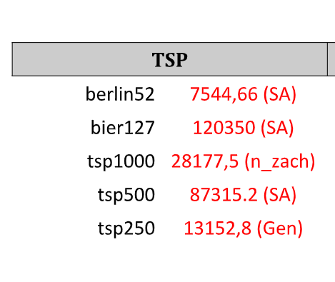
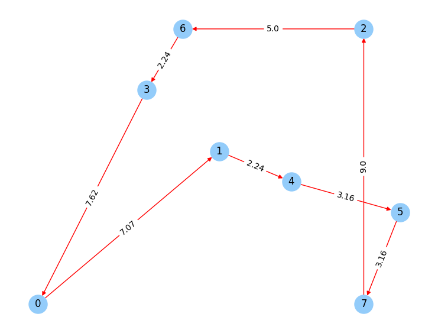

# Ant Colony Optimization for Combinatoral optimization classes

## Table of contents
* [General info](#general-info)
* [How ACO works](#how-aco-works)
* [Tech stack](#tech-stack)

## General info
Combinatoral optimization class project. It was meant to build Ant Colony Optimization metaheuristics and compare it with greedy algorithm for travelling salesman problem.
Input is list of (X,Y) points as towns for salesman and graph is complete graph.
There are few benchmark instantions with their optimal paths in optimal_TSP.png.

Script also provides option to plot path with use of networkX 

## How ACO works
First, we initalize distance matrix,with well, distances between nodes, and pheromones matrix with 1/distance.
After this, algorithm really starts - Ants choose next node randomly, but probability IS NOT even. It is equal to:

$ pheromoneOnEdge^α + (1 / distance)^β $

Where distance is weigth(length in our case) of current edge. So, ants are going to shortest edges, but what about pheromones? That's the fun part.
When ant finishes it's journey - finds hamiltonian cycle. It leaves pheromone trail behind, which value is equal to $1/totalDistance$, that means shorter cycle => more pheromones => ants in next iteration will be more likely to choose this short path. It's worth mentioning that pheromones evaporate after every iteration(not completely of course) which is good, because ants won't focus so much on one possible route.

** Disclaimer - ACO is meant to find relatively good path, not optimal one.

## Tech stack
- Python3
- NetworkX

